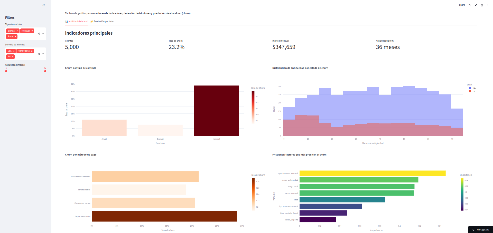

# 📊 Customer Analytics & Churn Prediction Dashboard

🔗 **[Ver demo en vivo](https://customer-analytics-dashboard-7pcahlwsxr9zdxvpy8lmnw.streamlit.app/)**

> Plataforma de analítica de clientes que monitorea indicadores clave, detecta fricciones que afectan la experiencia del cliente y predice el abandono (churn) usando Machine Learning.

[](https://www.python.org/)
[](https://streamlit.io/)
[](https://scikit-learn.org/)
[](https://opensource.org/licenses/MIT)

---

## 🖥️ Demo



---

## 🎯 ¿Qué resuelve este proyecto?

Las empresas de servicios pierden ingresos cuando sus clientes abandonan (*churn*). Este proyecto entrega una **herramienta de gestión** que permite:

- **Monitorear** los indicadores principales del negocio (tasa de churn, ingresos, antigüedad).
- **Detectar fricciones**: qué factores hacen que un cliente se vaya.
- **Comparar 3 modelos** de ML (Random Forest, Regresión Logística, Gradient Boosting) con métricas lado a lado y selección automática del mejor.
- **Predecir** en tiempo real la probabilidad de que un cliente específico abandone, para activar acciones de retención.
- **Predecir en lotes**: carga un CSV de clientes y obtén la probabilidad de churn de todos en un solo paso.

Esto cubre el ciclo completo de **analítica de datos → modelado predictivo → tablero de decisión**.

---

## 🧩 Arquitectura

```
customer-analytics-dashboard/
├── data/
│   └── clientes.csv            # Dataset de clientes (5,000 registros)
├── models/
│   ├── modelo_churn.pkl        # Modelo entrenado (RandomForest)
│   └── importancias.csv        # Importancia de variables
├── notebooks/
│   └── analisis_exploratorio.ipynb   # EDA paso a paso
├── src/
│   ├── generate_data.py        # Generación del dataset
│   ├── train_model.py          # Entrenamiento y evaluación del modelo
│   └── dashboard.py            # Dashboard interactivo (Streamlit)
├── requirements.txt
└── README.md
```

---

## 🚀 Cómo ejecutarlo

```bash
# 1. Clonar el repositorio
git clone https://github.com/jbandao137/customer-analytics-dashboard.git
cd customer-analytics-dashboard

# 2. Crear entorno virtual e instalar dependencias
python3 -m venv venv
source venv/bin/activate        # En Windows: venv\Scripts\activate
pip install -r requirements.txt

# 3. Generar los datos
python3 src/generate_data.py

# 4. Entrenar el modelo
python3 src/train_model.py

# 5. Lanzar el dashboard
streamlit run src/dashboard.py
```

El dashboard abrirá en `http://localhost:8501`.

---

## 🔬 Metodología

### 1. Datos
Dataset de 5,000 clientes con variables demográficas, de servicio y de comportamiento (antigüedad, cargos, tickets de soporte, tipo de contrato, etc.).

### 2. Modelos
Se entrenan **3 algoritmos** dentro de `Pipeline`s de scikit-learn (One-Hot Encoding + clasificador), todos balanceados por clase. El de mayor AUC-ROC se selecciona automáticamente:

| Modelo | AUC-ROC | Recall (churn) |
|--------|---------|----------------|
| Random Forest | ~0.74 | ~0.57 |
| Regresión Logística | ~0.70 | ~0.55 |
| Gradient Boosting | ~0.75 | ~0.58 |

### 3. Insights de negocio
Los factores que más predicen el abandono son:
1. **Tipo de contrato mensual** (mayor riesgo)
2. **Baja antigüedad** del cliente
3. **Cargos mensuales altos**
4. **Pago por cheque electrónico**
5. **Volumen de tickets de soporte**

---

## 🛠️ Stack tecnológico

`Python` · `pandas` · `scikit-learn` · `Plotly` · `Streamlit` · `joblib`

---

## 📈 Posibles mejoras

- Conectar a una base de datos real (PostgreSQL/MySQL) en lugar de CSV.
- Desplegar en la nube (Streamlit Cloud / Render / AWS).
- Pipeline de reentrenamiento automático (MLOps con MLflow o DVC).

---

## 🤝 Contribuciones

Este es un proyecto de portafolio. Si encontrás un bug o tenés una sugerencia, abrí un issue o un pull request.

---

*Proyecto de portafolio enfocado en analítica de datos y machine learning aplicado a la gestión de clientes.*
